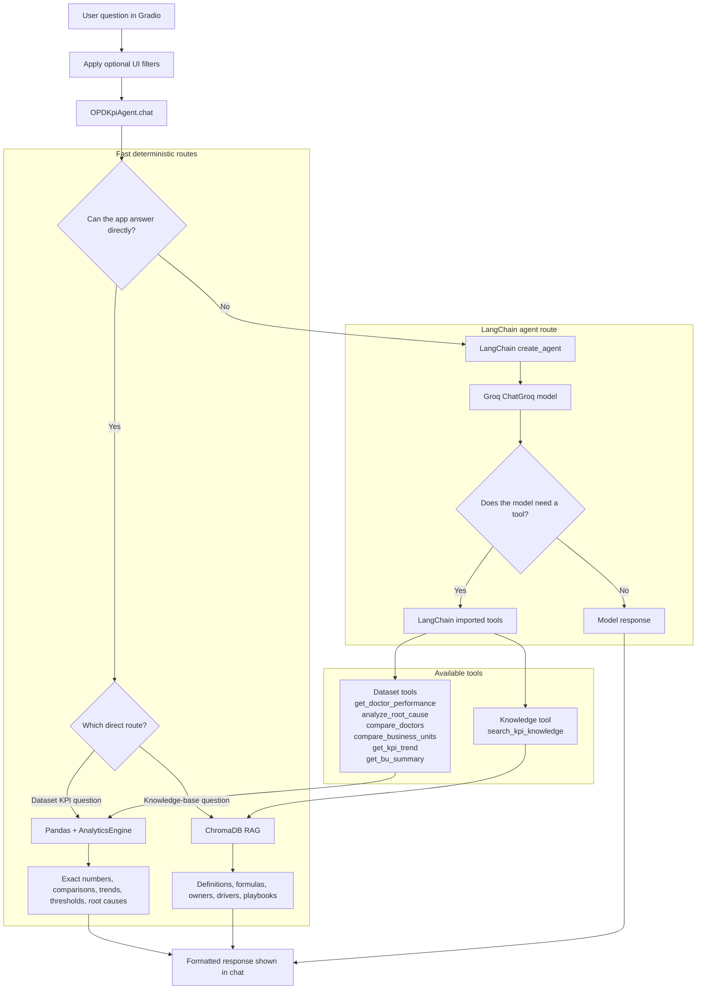

# OPD KPI Intelligence Agent

An interactive Gradio app for analyzing Outpatient Department (OPD) KPI performance across business units, doctor-BU profiles, time periods, and operational drivers.

The app uses a hybrid analytics architecture:

- **Dataframe analytics** for exact KPI numbers, trends, comparisons, thresholds, and root-cause calculations.
- **ChromaDB RAG** for KPI knowledge-base retrieval: definitions, formulas, owners, drivers, investigation steps, playbooks, and recommended actions.
- **Optional Dataverse formula fallback** through a Power Automate HTTP flow when a formula is missing from the Excel knowledge base.
- **Groq + LangChain** for broader natural-language reasoning when a request does not map cleanly to a deterministic route.

The model should not guess KPI facts from memory. Numeric answers are grounded in `data/OPD dataset.xlsx`, and knowledge answers are grounded in `data/Knowledge base.xlsx` through Chroma retrieval.

## Key Features

- Modern Gradio chat interface with BU, doctor, year, and KPI filters
- Doctor-BU profile handling: `Ahmed (ASH)`, `Ahmed (HJH)`, and `Ahmed (SMH)` are treated as separate profiles
- If a doctor name is provided without a BU, the app answers for all available doctor-BU profiles for that doctor
- BU comparison across ASH, SMH, and HJH
- Root-cause analysis using the KPI relationship map
- Chroma-backed RAG lookup for KPI definitions, formulas, owners, playbooks, and relationships
- Optional PowerApps/Dataverse lookup for extra KPI formulas not present in `data/Knowledge base.xlsx`
- KPI trend analysis over time
- Threshold questions such as doctors above a no-show rate
- Natural-language KPI resolution, for example `service leakage`, `PMS`, or `patient retention`
- Guardrails for unknown KPIs: the app does not invent definitions or formulas for KPIs that are not in the loaded dataset or knowledge base

## Example Questions

```text
Show me Doctor Ahmed's performance, and give me justifications for his KPIs
Show me Doctor Ahmed's performance in HJH, and give me justifications for his KPIs
Justify Dr. Ola's PMS performance in HJH
What are the root causes of high service leakage in HJH?
What is causing high service leakage in HJH, and what investigation steps should the PA Supervisor follow?
Search the KPI knowledge base for Service Leakage %. Tell me the KPI owner, business question, financial impact formula, primary and secondary drivers, and investigation steps.
Compare patient retention across ASH, SMH, and HJH in 2023
Which doctors have a no-show rate above 20%?
Show the monthly trend for Service Leakage % in HJH for 2025
What is the definition and calculation formula for the KPI Patient Retention %?
```

## Project Structure

```text
OPD Agent/
+-- app.py
+-- requirements.txt
+-- setup.py
+-- README.md
+-- data/
|   +-- OPD dataset.xlsx
|   +-- Knowledge base.xlsx
+-- src/
    +-- config.py
    +-- agents/
    |   +-- kpi_agent.py
    +-- analytics/
    |   +-- engine.py
    +-- data/
        +-- loader.py
        +-- vector_store.py
```

## Data Files

The app expects:

```text
data/OPD dataset.xlsx
data/Knowledge base.xlsx
```

The OPD workbook must contain a sheet named:

```text
OPD_KPI_Dataset
```

The knowledge-base workbook can include KPI definitions, formulas, relationship maps, investigation playbooks, owners, driver weights, and recommended actions.

## How ChromaDB RAG Works

This project uses a lightweight RAG pattern:

1. The app loads `data/Knowledge base.xlsx`.
2. `src/data/vector_store.py` indexes knowledge-base rows and KPI catalog aliases into a local persistent ChromaDB collection.
3. KPI knowledge questions retrieve the most relevant records from Chroma.
4. The final answer shows readable KPI fields and a concise source line instead of raw retrieved records.

Chroma is used for knowledge retrieval, not numeric calculations. Exact KPI values still come from dataframe analytics.

The local Chroma folder is generated automatically at:

```text
data/chroma_DB/
```

Do not upload `data/chroma_DB/` or `data/chroma_db/` to Hugging Face or Git. It contains generated SQLite/index files and can be rebuilt from `data/Knowledge base.xlsx`.

## Application Flow



## Core Modules

### `app.py`

Gradio application entry point.

- Builds the web interface
- Adds optional filters for BU, doctor-BU profile, year, and KPI
- Sends user messages to `OPDKpiAgent`
- Launches the Gradio server
- Includes a narrow startup-log cleanup hook for a harmless hosted asyncio warning

### `src/agents/kpi_agent.py`

Main intelligence layer.

- Initializes the data loader, analytics engine, Chroma store, Groq model, and LangChain agent
- Routes common questions to deterministic dataframe or Chroma-backed responses
- Keeps doctor-BU profiles separate
- Formats executive readouts, evidence, drivers, and recommendations
- Blocks invented definitions for unknown KPIs

### `src/data/loader.py`

Data ingestion and KPI metadata layer.

- Loads the OPD dataset workbook
- Loads every sheet in the knowledge-base workbook
- Prepares `Date`, `YearMonth`, `Year`, and `Month_Num`
- Creates derived metrics:
  - `Revenue_Achievement_%`
  - `Cases_Achievement_%`
  - `Revenue_per_Case`
  - `Leakage_Impact_%`
- Builds KPI aliases for natural-language resolution
- Provides doctor-BU profile helpers

### `src/data/vector_store.py`

Persistent ChromaDB knowledge-store layer.

- Opens or creates the local Chroma database
- Indexes knowledge-base rows
- Indexes KPI catalog aliases
- Supports semantic search and KPI-scoped retrieval
- Uses a local hash-based embedding function, so no hosted embedding API is required

### `src/analytics/engine.py`

Statistical and operational analytics layer.

- Performs root-cause analysis
- Compares current and previous periods
- Aggregates sums for volume/financial metrics and averages for percentages/rates
- Detects anomalies using Z-scores
- Ranks doctors and doctor-BU profiles by KPI
- Uses the relationship map to identify KPI drivers

### `src/config.py`

Central configuration file for paths, model settings, thresholds, and server settings.

## Setup Locally

### 1. Create and activate a virtual environment

```powershell
python -m venv .venv
.\.venv\Scripts\Activate.ps1
```

If you are using UV-managed Python, create the environment with your preferred UV Python version, then use the `.venv` interpreter for installs and app startup.

### 2. Install dependencies

```powershell
pip install -r requirements.txt
```

### 3. Set your Groq API key

Create a key from:

```text
https://console.groq.com/keys
```

Set it in PowerShell:

```powershell
$env:GROQ_API_KEY="your_api_key_here"
```

For a persistent Windows user variable:

```powershell
setx GROQ_API_KEY "your_api_key_here"
```

Restart your terminal after `setx`.

### 4. Run the app

```powershell
python app.py
```

Open:

```text
http://127.0.0.1:7860
```

## Configuration

Common environment variables:

| Variable | Default | Description |
|---|---:|---|
| `GROQ_API_KEY` | Required for full LLM mode | Groq API key |
| `LLM_MODEL` | `openai/gpt-oss-120b` | Groq model name |
| `LLM_REASONING_EFFORT` | `medium` | Reasoning effort for GPT-OSS models |
| `TEMPERATURE` | `0.0` | LLM response randomness |
| `LLM_MAX_TOKENS` | `1024` | Maximum generated tokens |
| `LLM_TIMEOUT` | `60` | LLM request timeout in seconds |
| `LLM_MAX_RETRIES` | `2` | LLM retry count |
| `VECTOR_STORE_PATH` | `data/chroma_DB` | Local generated Chroma database folder |
| `SERVER_HOST` | `127.0.0.1` locally, `0.0.0.0` on Spaces | Gradio host |
| `POWER_AUTOMATE_DATA_REQUEST_URL` | Empty | Optional Power Automate HTTP trigger URL for missing KPI/raw-data requests |
| `DATA_REQUEST_SOURCE_SYSTEM` | `OPD KPI Agent` | Source-system label sent in missing-data requests |
| `DATAVERSE_KPI_FORMULA_LOOKUP_URL` | Empty | Optional Power Automate HTTP trigger URL that looks up KPI formulas from Dataverse |
| `DATAVERSE_FORMULA_SOURCE_LABEL` | `Dataverse KPI formula table` | Source label shown when a formula comes from Dataverse |

Example:

```powershell
$env:GROQ_API_KEY="your_api_key_here"
$env:LLM_MODEL="openai/gpt-oss-120b"
$env:LLM_REASONING_EFFORT="medium"
$env:LLM_MAX_TOKENS="1024"
python app.py
```

### Dataverse Formula Fallback

If some KPI formulas are not in `data/Knowledge base.xlsx`, create a Dataverse table in PowerApps and expose it through a Power Automate HTTP-trigger flow. The Python app does not need Dataverse credentials; it sends a lookup request to the flow, and the flow queries Dataverse.

Recommended Dataverse table columns:

| Column | Purpose |
|---|---|
| `KPI Name` | KPI display name or alias to match user wording |
| `Formula` | Extra calculation formula |
| `Definition` | Optional KPI definition |
| `Owner` | Optional KPI owner or responsible role |

Configure the app:

```powershell
$env:DATAVERSE_KPI_FORMULA_LOOKUP_URL="https://prod-xx.logic.azure.com/..."
```

The flow receives:

```json
{
  "sourceSystem": "OPD KPI Agent",
  "requestType": "kpi_formula_lookup",
  "kpiName": "Customer Churn Rate"
}
```

Return either a single JSON object or an array. The app accepts common field names such as `formula`, `Formula`, `Formula_Logic`, `adx_formula`, `kpiName`, `KPI_Name`, `definition`, and `owner`.

Example response:

```json
{
  "found": true,
  "kpiName": "Customer Churn Rate",
  "formula": "(Patients lost during period / Patients active at start of period) x 100",
  "definition": "Percentage of active patients who did not return in the measured period.",
  "owner": "OPD Operations"
}
```

When a user asks for a formula, the agent checks the Excel knowledge base first. If the formula is missing or marked as not configured, it calls the Dataverse fallback and labels the answer as coming from the Dataverse KPI formula table.

### Missing KPI / Raw Data Requests

When a user asks for a KPI that needs unavailable patient-level or claims-level raw data, the agent can submit a structured request to a Power Automate flow. Configure the flow with an HTTP trigger, then set:

```powershell
$env:POWER_AUTOMATE_DATA_REQUEST_URL="https://prod-xx.logic.azure.com/..."
```

For example, insurance rejection rate by doctor is not available in the current OPD extract because the dataset has `Credit Revenue` but no rejected-claim count, rejected-claim amount, approval status, or rejection reason at patient/claim grain. In that case the agent sends a JSON payload containing:

- requested KPI name
- unavailable reason
- required patient/claim raw fields
- required patient/claim raw fields as one text block in `neededFieldsText`
- requested grain, such as patient encounter / claim line with doctor, BU, payer, and date
- recommended numerator and denominator

## Hugging Face Spaces Deployment

This README includes the required Hugging Face Spaces YAML metadata at the top:

```yaml
sdk: gradio
sdk_version: "6.14.0"
python_version: "3.11"
app_file: app.py
```

Upload:

```text
app.py
requirements.txt
setup.py
README.md
src/
data/OPD dataset.xlsx
data/Knowledge base.xlsx
```

Do not upload:

```text
data/chroma_DB/
data/chroma_db/
.venv/
.env
```

Set `GROQ_API_KEY` in the Space secrets/settings. The Chroma database will be rebuilt at startup inside the Space from `data/Knowledge base.xlsx`.

## Questions to Test

Use these prompts after starting the app:

```text
Show me Doctor Ahmed's performance, and give me justifications for his KPIs
```

Expected behavior: returns separate sections for all available Ahmed profiles: `Ahmed (ASH)`, `Ahmed (HJH)`, and `Ahmed (SMH)`.

```text
Show me Doctor Ahmed's performance in HJH, and give me justifications for his KPIs
```

Expected behavior: returns only `Ahmed (HJH)`.

```text
Search the KPI knowledge base for Service Leakage %. Tell me the KPI owner, business question, financial impact formula, primary and secondary drivers, and investigation steps.
```

Expected behavior: returns a Chroma-backed KPI knowledge lookup with a concise source line.

```text
What is causing high service leakage in HJH, and what investigation steps should the PA Supervisor follow?
```

Expected behavior: returns HJH root-cause metrics plus knowledge-base investigation steps.

```text
Compare patient retention across ASH, SMH, and HJH in 2023.
```

Expected behavior: returns a BU comparison from the dataframe.

```text
Which doctors have a no-show rate above 20%?
```

Expected behavior: returns doctor-BU profiles matching the threshold.

```text
What is the definition and calculation formula for the KPI Customer Churn Rate?
```

Expected behavior: states that the KPI is not found if it is not configured in the dataset or knowledge base, rather than inventing a formula.

## Troubleshooting

### Hugging Face YAML metadata error

The allowed `colorFrom` and `colorTo` values are:

```text
red, yellow, green, blue, indigo, purple, pink, gray
```

This project uses `green` and `blue`.

### Chroma upload hash mismatch on Hugging Face

Do not upload the generated Chroma folder. Delete it from the Space repo if it was uploaded:

```text
data/chroma_DB/
data/chroma_db/
```

The app rebuilds Chroma on startup.

### Very slow answers

Structured KPI and knowledge-base questions should answer quickly. If a question is slow, it may have fallen back to the LLM. Make the request more explicit:

```text
Compare Patient Retention % across all BUs in 2023
Search the KPI knowledge base for Service Leakage %
```

### Data file not found

Confirm these files exist:

```text
data/OPD dataset.xlsx
data/Knowledge base.xlsx
```

Also confirm `data/OPD dataset.xlsx` contains the `OPD_KPI_Dataset` sheet.

### Groq API key error

Confirm `GROQ_API_KEY` is set in the same environment where the app runs:

```powershell
echo $env:GROQ_API_KEY
```

## Development Notes

Useful compile check:

```powershell
python -m py_compile app.py src\agents\kpi_agent.py src\analytics\engine.py src\data\loader.py src\data\vector_store.py src\config.py
```

Run the app:

```powershell
python app.py
```

## Privacy Notes

This app can run locally, but Groq inference is hosted. Any text sent to the LLM API is processed by Groq. Avoid sending private healthcare, patient, doctor, or operational details unless that is acceptable for your environment.

Do not publish private healthcare, patient, doctor, or operational data to a public repository. If the Excel files contain confidential information, keep the repository private or remove/anonymize the files before sharing.

## License

Add a license before publishing the repository publicly. If the dataset is proprietary or confidential, keep the project private.
