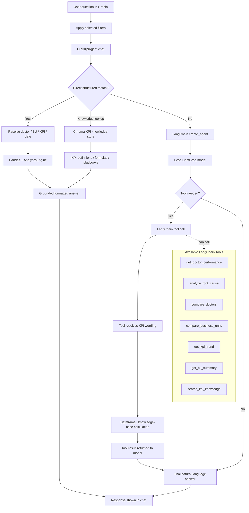

# OPD KPI Intelligence Agent

An interactive Gradio application for analyzing Outpatient Department (OPD) KPI performance across doctors, business units, time periods, and operational drivers.

The app combines a structured analytics engine, a local Chroma knowledge store, and a Groq-powered LangChain agent. Fast, high-confidence KPI questions are answered directly from the dataset and knowledge base, while broader natural-language questions can use the hosted LLM and the available analytical tools.

## Features

- Modern Gradio chat interface with KPI filters and prompt cards
- Doctor performance summaries and KPI justifications
- BU-level comparison across ASH, SMH, and HJH
- Root cause analysis using the knowledge-base relationship map
- Chroma-backed KPI knowledge lookup for definitions, formulas, owners, playbooks, and relationships
- KPI trend analysis over time
- Threshold questions such as doctors above a no-show rate
- Natural-language KPI resolution, for example `service leakage`, `PMS`, or `patient retention`
- Groq-hosted LLM support for faster agentic reasoning without running a model locally

## Example Questions

```text
Show me Doctor Ahmed's performance, and give me justifications for his KPIs
What are the root causes of high service leakage in HJH?
What is causing high service leakage in HJH, and what investigation steps should the PA Supervisor follow?
Search the KPI knowledge base for Service Leakage %. Tell me the KPI owner, business question, financial impact formula, primary and secondary drivers, and investigation steps.
Compare patient retention across all BUs in 2023
Which doctors have a no-show rate above 20%?
Justify Dr. Mahmoud's PMS performance in ASH
Show the trend for service leakage in HJH
```

## Project Structure

```text
OPD Agent/
+-- app.py
+-- requirements.txt
+-- setup.py
+-- README.md
+-- data/
|   +-- OPD dataset.xlsx
|   +-- Knowledge base.xlsx
|   +-- chroma_DB/
+-- src/
    +-- config.py
    +-- agents/
    |   +-- kpi_agent.py
    +-- analytics/
    |   +-- engine.py
    +-- data/
        +-- loader.py
        +-- vector_store.py
```

## Code Overview

### `app.py`

Main Gradio application entry point.

Responsibilities:

- Builds the web interface
- Displays the welcome message, dataset badges, prompt cards, and chat panel
- Adds optional filters for BU, doctor, year, and KPI
- Sends user questions to the KPI agent
- Launches the local Gradio server

Run this file to start the app:

```powershell
python app.py
```

### `src/agents/kpi_agent.py`

Main intelligence layer for the application.

Responsibilities:

- Initializes the data loader, analytics engine, Groq model, and LangChain agent
- Routes simple structured questions to fast dataframe-based answers
- Initializes the Chroma-backed KPI knowledge store
- Uses LangChain tools for more open-ended agent responses
- Formats professional responses with executive readouts, evidence, drivers, and recommendations
- Resolves doctors, BUs, years, KPIs, and threshold filters from natural-language questions

Important behavior:

- The agent avoids one-off hard-coded answers and relies on the loaded dataset, analytics engine, and knowledge base.
- It resolves KPI names using dataset columns and the knowledge base.
- It answers common structured questions directly for speed, including doctor KPI justification/profile requests, root-cause questions, and KPI knowledge-base lookups.
- For broader or less structured questions, it uses the LLM with analytical tools when available.

### `src/data/loader.py`

Data ingestion and KPI metadata layer.

Responsibilities:

- Loads `data/OPD dataset.xlsx`
- Loads all sheets from `data/Knowledge base.xlsx`
- Prepares date columns such as `Date`, `Year`, `Month_Num`, and `YearMonth`
- Creates derived metrics:
  - `Revenue_Achievement_%`
  - `Cases_Achievement_%`
  - `Revenue_per_Case`
  - `Leakage_Impact_%`
- Builds a KPI alias index so natural wording can map to real dataset columns
- Provides helper methods for doctors, BUs, KPI metadata, playbooks, and KPI relationships

### `src/data/vector_store.py`

Persistent Chroma knowledge-store layer.

Responsibilities:

- Opens a local Chroma database at `data/chroma_DB`
- Indexes rows from `data/Knowledge base.xlsx`
- Indexes KPI catalog aliases generated from the dataset and knowledge base
- Supports semantic knowledge search for definitions, formulas, owners, drivers, investigation steps, playbooks, and recommended actions
- Supports KPI-scoped retrieval so results stay focused on the resolved KPI

The store uses a local hash-based embedding function, so it does not need a hosted embedding API.

### `src/analytics/engine.py`

Statistical and operational analytics layer.

Responsibilities:

- Performs root cause analysis
- Compares current and previous periods
- Aggregates metrics correctly based on type:
  - sums for volume and financial metrics
  - averages for percentages and rates
- Detects anomalies using Z-scores
- Ranks doctors by KPI
- Uses the knowledge-base relationship map to identify KPI drivers

### `src/config.py`

Central configuration file.

Responsibilities:

- Defines model settings
- Defines hosted LLM settings
- Defines data paths
- Defines the Chroma vector-store path
- Defines default analysis thresholds
- Defines Gradio host and port

You can override many settings with environment variables.

### `requirements.txt`

Python dependencies needed to run the app.

Main libraries:

- `gradio`
- `pandas`
- `numpy`
- `scipy`
- `openpyxl`
- `langchain`
- `langchain-groq`
- `chromadb`

### `setup.py`

Optional Python package setup file. Useful if you want to install the project as a local package.

## Data Files

The app expects these files:

```text
data/OPD dataset.xlsx
data/Knowledge base.xlsx
data/chroma_DB/
```

The OPD dataset should include the main KPI table. The current loader expects a sheet named:

```text
OPD_KPI_Dataset
```

The knowledge base can include KPI definitions, relationship maps, and investigation playbooks. The agent uses it to resolve KPI meaning and explain root causes.

The Chroma database is created automatically at `data/chroma_DB` when the agent starts. It persists indexed knowledge-base records so later runs can search the KPI knowledge base quickly.

## Setup

### 1. Create and activate a virtual environment

```powershell
python -m venv .venv
.\.venv\Scripts\Activate.ps1
```

### 2. Install dependencies

```powershell
pip install -r requirements.txt
```

### 3. Create a Groq API key

Create an API key from:

```text
https://console.groq.com/keys
```

Then set it in your terminal:

```powershell
$env:GROQ_API_KEY="your_api_key_here"
```

The default Groq model is `openai/gpt-oss-120b` with `medium` reasoning effort.

### 4. Run the app

```powershell
python app.py
```

For a persistent Windows user environment variable, use:

```powershell
setx GROQ_API_KEY "your_api_key_here"
```

Restart your terminal after using `setx`.

By default, the app launches on:

```text
http://0.0.0.0:7860
```

On your local machine, open:

```text
http://127.0.0.1:7860
```

## Configuration

The default configuration is in `src/config.py`.

Common environment variables:

| Variable | Default | Description |
|---|---:|---|
| `GROQ_API_KEY` | Required | Groq API key |
| `LLM_MODEL` | `openai/gpt-oss-120b` | Groq model name |
| `LLM_REASONING_EFFORT` | `medium` | Reasoning effort for GPT-OSS models: `low`, `medium`, or `high` |
| `TEMPERATURE` | `0.0` | LLM response randomness |
| `LLM_MAX_TOKENS` | `1024` | Maximum generated tokens |
| `LLM_TIMEOUT` | `60` | LLM request timeout in seconds |
| `LLM_MAX_RETRIES` | `2` | LLM request retry count |
| `VECTOR_STORE_PATH` | `data/chroma_DB` | Local Chroma database folder |

Example:

```powershell
$env:GROQ_API_KEY="your_api_key_here"
$env:LLM_MODEL="openai/gpt-oss-120b"
$env:LLM_REASONING_EFFORT="medium"
$env:LLM_MAX_TOKENS="1024"
python app.py
```

## How the Agent Answers Quickly

The app uses a hybrid approach:

1. The user asks a natural-language question.
2. The agent extracts structured information:
   - doctor
   - business unit
   - year
   - KPI
   - threshold
   - requested operation
3. If the question maps clearly to a known analytics or knowledge-base operation, the app answers directly from the dataframe, Excel knowledge base, and Chroma.
4. If the question is broader or ambiguous, the agent can use Groq and LangChain tools.

This keeps simple questions fast while preserving agent-style reasoning for more complex requests.

### LangChain Flow



## Knowledge-Base Driven Analysis

The agent uses the knowledge base to avoid inventing KPI relationships.

It can read:

- KPI definitions
- KPI formulas
- Parent and child KPI relationships
- Driver weights
- Investigation steps
- Recommended actions

For example, root cause analysis for `Service Leakage %` uses the relationship map to identify drivers such as missed opportunities, workflow compliance, and follow-up behavior when those fields exist in the knowledge base.

For user readability, Chroma retrieval details are summarized as a short source line instead of dumping raw retrieved records into the chat response.

## Questions to Test

Use these prompts after starting the app:

```text
Search the KPI knowledge base for Service Leakage %. Tell me the KPI owner, business question, financial impact formula, primary and secondary drivers, and investigation steps.
```

Expected behavior: returns a KPI knowledge lookup only, with owner, formula, drivers, investigation steps, playbook scenarios, and a concise knowledge-source line.

```text
What is causing high service leakage in HJH, and what investigation steps should the PA Supervisor follow?
```

Expected behavior: returns HJH root-cause metrics plus knowledge-base investigation steps.

```text
Compare patient retention across ASH, SMH, and HJH in 2023.
```

Expected behavior: returns a BU comparison from the dataframe.

```text
Which doctors have a no-show rate above 20%?
```

Expected behavior: returns doctors matching the threshold.

```text
Justify Dr. Mahmoud's PMS performance in ASH.
```

Expected behavior: returns doctor-level KPI justification with peer context and knowledge-base drivers.

```text
Show the monthly trend for Service Leakage % in HJH for 2025.
```

Expected behavior: returns a month-by-month trend from the dataset.

## Troubleshooting

### Import error from LangChain

If you see an import error, reinstall dependencies:

```powershell
pip install -r requirements.txt --upgrade
```

### Groq API key error

Confirm `GROQ_API_KEY` is set in the same terminal where you run the app:

```powershell
echo $env:GROQ_API_KEY
```

Then restart the app. You can also choose a different Groq model:

```powershell
$env:LLM_MODEL="openai/gpt-oss-120b"
```

### Very slow answers

The app should answer structured KPI and knowledge-base questions quickly. If a question is slow, it may have fallen back to the LLM.

Try making the question more explicit:

```text
Compare Patient Retention % across all BUs in 2023
Search the KPI knowledge base for Service Leakage %
```

instead of:

```text
Tell me about retention
```

### Data file not found

Make sure these files exist:

```text
data/OPD dataset.xlsx
data/Knowledge base.xlsx
```

Also confirm that the OPD workbook contains the `OPD_KPI_Dataset` sheet.

## Privacy Notes

This project runs the app locally, but Groq inference is hosted. Any text sent to the LLM API is processed by Groq, so avoid sending private healthcare, doctor, patient, or operational details unless that is acceptable for your environment.

Do not publish private healthcare, doctor, patient, or operational data to a public repository. If the Excel files contain confidential information, keep the repository private or remove/anonymize the files before sharing.

## Development Notes

Useful checks:

```powershell
python -m py_compile app.py src\agents\kpi_agent.py src\analytics\engine.py src\data\loader.py src\data\vector_store.py src\config.py
```

Run the app:

```powershell
python app.py
```

## License

Add a license before publishing the repository publicly. If the dataset is proprietary or confidential, keep the project private.
